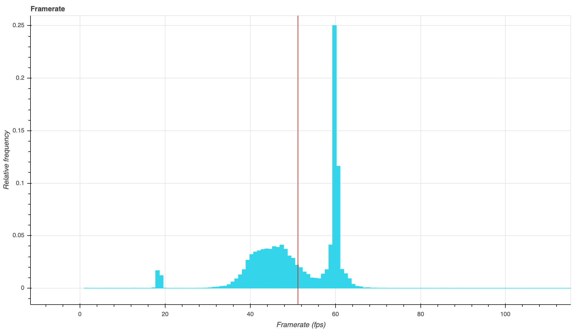

# PresentMonAnalysis
A statistical analysis tool for game benchmarks using [Bokeh](https://github.com/bokeh/bokeh) and [Numpy](https://github.com/numpy/numpy).

## Background
The goal is to enable visual and mathematical analysis of benchmark data generated by [PresentMon](https://github.com/GameTechDev/PresentMon), a tool developed by Intel for collecting frame time data on Windows. PresentMon supports any graphics API (DX, OpenGL, Metal, etc) as well as UWP, so this tool can in principle be used to analyze the performance of a wide range of Windows applications.

PresentMon outputs data in CSV format, either to file or standard output (STDOUT). PresentMonAnalysis is intended to easier gain insights from the generated data using relatively simple tools.

_Example output of a framerate distribution, representing the proportion of frames corresponding to a framerate in any interval._

## Output format
This tool uses Bokeh to generate interactive charts in HTML and JS.

## Usage
`Python PresentMonAnalysis [-f PATH] [-debug]`

Use the `-f PATH` argument to manually supply a CSV file (single file for now).
Use the `-debug` argument to print debug info during runtime (such as total script time).
You can use either `-f PATH`, `-debug` or both.

Using `-debug` without specifying `-f PATH` will make use of a supplied example file. Using them in conjuction will print debug info for the manually selected file. Using no argument at all will print an error.

Example:
`Python PresentMonAnalysis -f ./TestData/csgo.csv`

## What works
- Histogram view with fixed values (result file path is hard coded, currently to an included example file) representing the relative frequency of FPS values.
- Tabbed switching between frame times and framerate for histogram
- Frametimes plotted against time
- Text box with basic frame-to-frame statistics (maximum, minimum and average difference in rendering time between two successive frames)

## In progress
- Multi-file support (appending time stamps)
- In-chart switching between frame times (ms) and frequency (fps) for all relevant charts
- Switching between frame data (for instance, between msBetweenPresents and msUntilDisplayed)
- More advanced statistics
    - Analysis by percentile
    - Stutter analysis
        - Average/max/min time before framerate drops under certain thresholds (60/120/144 Hz etc)

## Dependencies
- Python 3.7
- Numpy
- Bokeh
